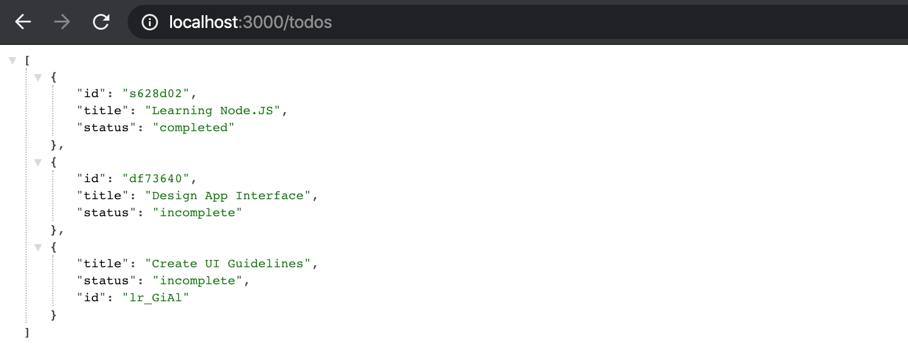
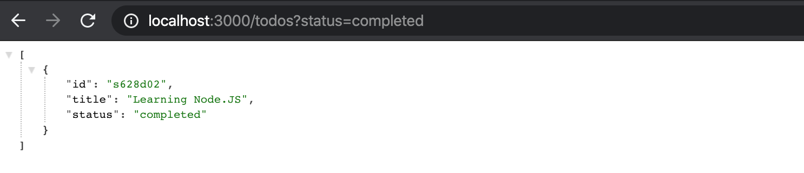

# express-todo-server

A Simple Todo REST API Built Using Package JSON-Server

## Screenshoot




## Build Setup

This project developed using package [JSON Server](https://github.com/typicode/json-server), for complete documentation please take a look into official documentation in <https://github.com/typicode/json-server>.

```bash
# install dependencies
$ npm install

# serve with hot reload at localhost:3000
$ npm run dev
```

---

Copyright © 2020 by Gunali Rezqi Mauludi
